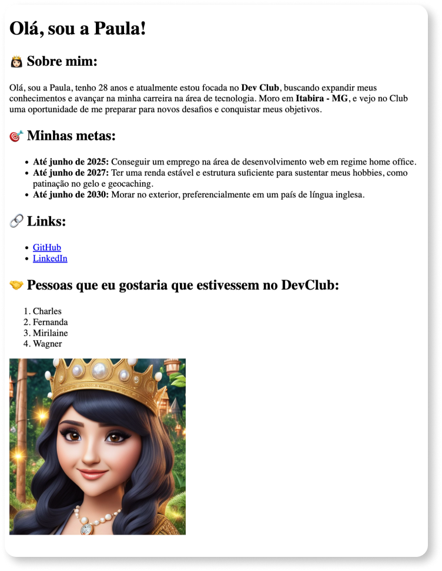

# Profile

This project is an **Profile page**, created as part of my learning journey in web development.
The objective was to build a **About Me page** to practice essential HTML concepts and provide information about me.

## 📸 Screenshots

## 🔗 Links

&nbsp;&nbsp;

## 👷🏻‍♀️ Built with

- HTML

### 🚀Features

- Semantic HTML

## 👩🏻‍💻 Author

&nbsp;&nbsp;

&nbsp;&nbsp;

